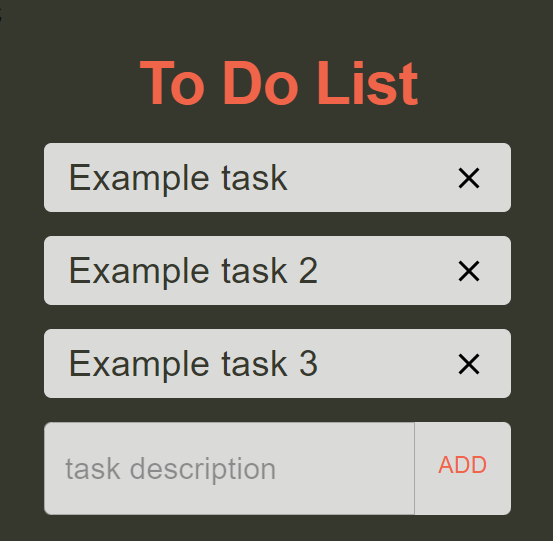

# To Do List App

A To Do List application used to add and delete tasks buiilt with React, Reduxt Toolkit, TypeScript, Styled Components, Axios, and Material UI.

## Project Screen Shot(s)

## Installation and Setup Instructions

### Installation:

**npm install**

### To run test suite:

**npm test**

### To start server

**npm start**

### To visit App

**localhost:3000**

## Data Layer

### Data:

- Task: {
  description: string,
  status: boolean
  }

## Components

### App

#### Show:

- Header component
- Task component
- Loading component
- Add input component

### Header

#### Show:

- A heading level 1 title with the text 'To Do List'

### Task

#### Show:

- Paragraphs with the name of the task
- 'X' icon to delete the tasks

### Loading

#### Show:

- A container animated

#### Get actions:

- While loading the API content the loading is shown

### Add input

#### Show:

- A textfield input with a placeholder 'task description'
- A button with the text 'ADD'
